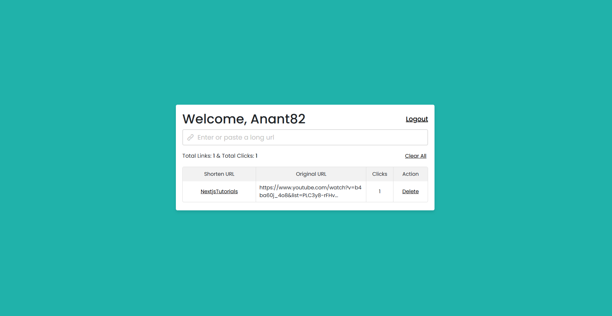
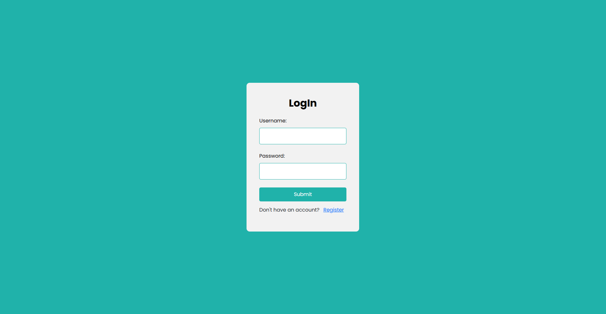
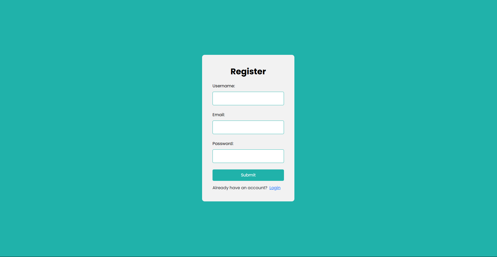

# 📄 **URL Shortener with Login & Registration**

---

## 🔥 **Description**
This is a simple URL shortener web application built using PHP and MySQL. It allows users to register, log in, and create shortened URLs. The application also tracks the number of clicks on each shortened URL. Only registered users can create and manage their shortened links.

---

## ✅ **Features**
- 🔗 **URL Shortening:** Convert long URLs into short, easy-to-share links.  
- 🔒 **User Authentication:** Secure login and registration system using PHP and MySQL.  
- 📊 **Click Tracking:** Keep track of the number of clicks on each shortened URL.  
- 👤 **User Management:** Each user can view and manage their own shortened URLs.  
- 🔑 **Secure Password Hashing:** Uses `md5()` for secure password storage.  
- 🌐 **Redirection:** Automatically redirects users from the short URL to the original long URL.  

---

## 🛠️ **Tech Stack**
- **Backend:** PHP (Core PHP)  
- **Database:** MySQL  
- **Frontend:** HTML5, CSS3, Bootstrap  
- **Security:** Password hashing and prepared statements to prevent SQL injection  

---

## 📥 **Installation**
1. **Clone the Repository:**
   ```
   git clone https://github.com/Anant-Navadiya/url_shortener.git
   ```
2. **Create Database:**

   Create `url_shortener` named database and import the `url_shortener.sql` file.
3. **Run Application:**
    + Windows - Use xampp to run application
    + Mac & Linux - ```php -S 127.0.0.1:8000```


---

## 📸 **Screenshots**






